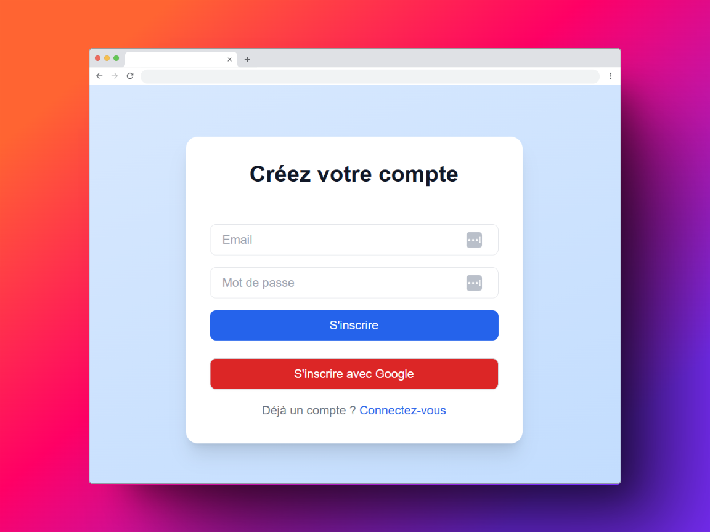
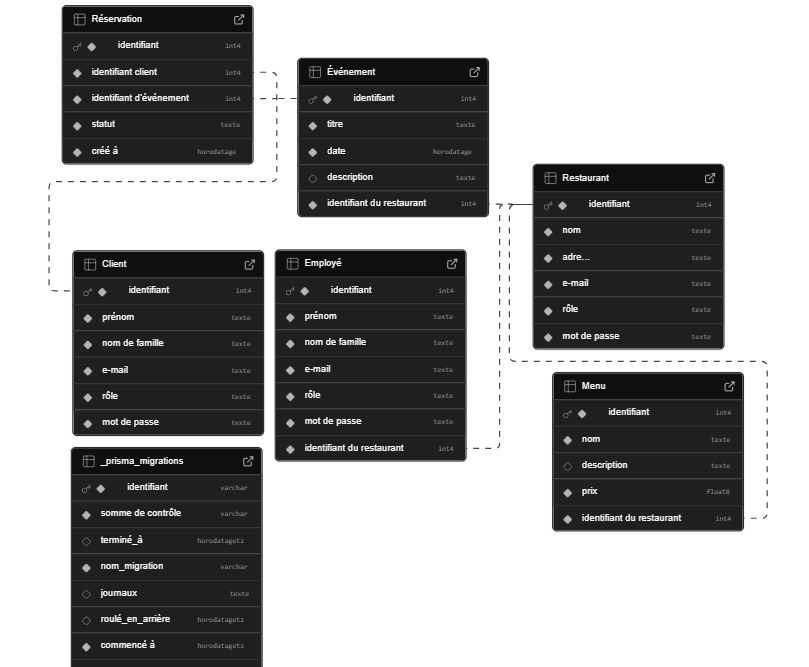
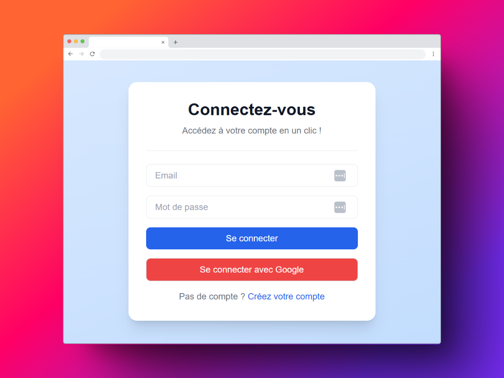
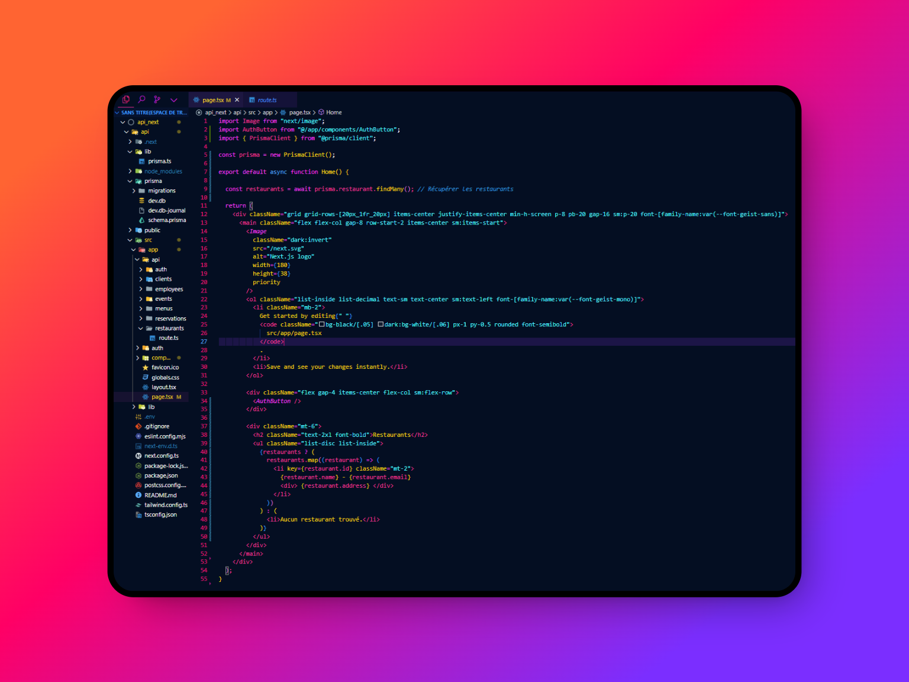

<div align="center">

# 🍽️ API Restaurants – Projet Fullstack avec Next.js



</div>

---

## 🌍 Description du projet

Application web développée avec **Next.js**, intégrant une authentification sécurisée via **NextAuth**, une base de données **SQLite** gérée avec **Prisma**, et une API REST permettant d’accéder à une liste de restaurants.

Ce projet met en œuvre :
- 🔐 Un système d’inscription / connexion
- 📂 Une base de données SQLite accessible via Prisma
- 🔁 Des routes API RESTful
- 🧪 Un environnement de test local complet

---

## 👤 Informations de Connexion (Compte de Test)

- **Email** : `Test@Test.Fr`  
- **Mot de passe** : `Testdu73`

---

## 🖼️ Screenshots





---

## 🌐 Routes API disponibles

| Route                    | Méthode | Description                                |
|-------------------------|---------|--------------------------------------------|
| `/auth/signin`          | POST    | Connexion utilisateur                      |
| `/auth/signout`         | POST    | Déconnexion utilisateur                    |
| `/api/auth/session`     | GET     | Vérification de session active             |
| `/api/restaurants`      | GET     | Récupération des données des restaurants   |

---

## ⚙️ Démarrer le projet

### 1. Création de l'app Next.js

```bash
npx create-next-app@latest
# Appuyer sur Entrée à chaque étape
```

### 2. Lancer le serveur local

```bash
npm run dev
```

---

## 🧱 Configuration de la base de données avec Prisma

### 1. Installer Prisma

```bash
npm install prisma --save-dev
npx prisma init --datasource-provider sqlite
```

### 2. Définir ton schéma dans `prisma/schema.prisma`  
(*Écris ton modèle de base de données*)

### 3. Migrer la base de données

```bash
npx prisma migrate dev --name init
```

### 4. Accéder à Prisma Studio

```bash
npx prisma studio
```

---

## 📦 Dépendances à installer

```bash
npm install bcrypt @types/bcrypt
npm install next-auth
```

---

🙌 Remerciements  
Merci d’avoir visité ce projet ! Ce projet est un **exercice fullstack** combinant **Next.js, API REST, Prisma et Auth**.  
N'hésitez pas à forker, commenter ou contribuer 💡

<div align="center">

⭐ *Un petit like sur le repo fait toujours plaisir !* ⭐

</div>


        


